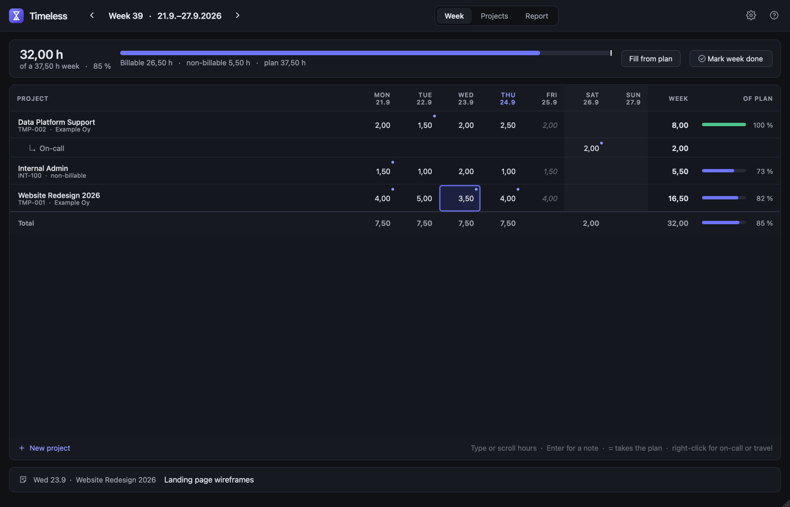

# Timeless

A calm, personal timesheet. One week at a time: type the hours, write a
line about the day, and see at a glance how the week sits against your
plan and a full week. Nothing to save, nothing to submit.



Built with Python, PySide6 (Qt) and SQLite. Everything stays on your
own computer.

## Install & run

You need Python 3.10 or newer.

**As an app you start with `timeless`**, from anywhere. The easiest way
is [pipx](https://pipx.pypa.io), which gives Timeless its own
environment (`brew install pipx` on macOS):

```bash
pipx install git+https://github.com/MrChillStorm/Timeless.git
timeless
```

Plain `pip install` into your own virtual environment works too
(`pip install git+https://github.com/MrChillStorm/Timeless.git`).
Homebrew's system Python refuses a plain `pip install`, which is why
pipx or a venv is the way. The package is called `timeless-timesheet`,
because `timeless` is already taken on PyPI.

**From a clone**, which is also what `Timeless.app` uses:

```bash
git clone https://github.com/MrChillStorm/Timeless.git
cd Timeless
python3 -m pip install -r requirements.txt
python3 -m timeless
```

Or double-click **Timeless.app** in the folder. The app bundle has to
stay in this folder, because it starts the code next to it. If you downloaded a ZIP instead of cloning and macOS refuses
to open the app, right-click it and choose Open once. Timeless is built and used on macOS. It's plain Qt, so
`python3 -m timeless` should also work on Windows and Linux, where ⌘
means Ctrl, but only macOS has been tried.

## How it works

**The week** is the whole app most days. Move between weeks with the
arrows, by scrolling over the week, or from the calendar under it.

- **Your projects are the rows.** Every active project appears in every
  week, so there are no lines to add, copy or delete. Archive a project
  when it's over.
- **Type hours straight into a day:** `7,5`, `7.5`, `7:30` or `8h`, or
  select the day and scroll to step it by half an hour. Arrows and Tab
  move around, and Delete clears a day. Everything saves as you go.
  **⌘Z** undoes, and **⇧⌘Z** redoes; a burst of scrolling is one undo
  step.
- **The plan is in the grid.** Each project has a weekly pattern, which
  shows faintly in empty days. Press **=** on a day to take it, or
  **Fill from plan** to fill the whole week. Holidays never get planned
  hours.
- **Notes live in the bar under the grid.** It shows the note of
  whatever is selected. Select a day for that day's note, or a project's
  name for the project's own notes (contacts, order numbers, how to book
  it). Press **Enter** to write, and Enter again to come back. Days with
  a note get a dot, and hovering a project shows its notes.
- **Special kinds of hours**, such as on-call or travel, get their own
  row under a project: right-click the project. They count toward the
  project's plan, and a kind can change billing (e.g. travel that isn't
  invoiced).
- **The strip at the top** shows the week's hours against your full
  week, with holidays taken out, and a tick where the plan would put
  you. Below it are the billable and non-billable split and the plan
  total. **Of plan** shows each project's progress, and turns amber when
  it goes over.
- **Not everything needs a plan.** For all-hands, training and other
  internal time, make a project with no planned hours (and billable
  off), and write what it was in the day's note. Its hours count toward
  the day, the week and the billable split, but it has no Of plan of its
  own, so it can't put a project behind or over. The week's total Of
  plan counts every hour you entered: a meeting on top of a full plan
  shows there, and one that took time from a project shows on that
  project's row.
- **Mark week done** once it's reported or invoiced. The week becomes
  read-only until you reopen it.

**Projects** lists your projects in one editable table: name, code,
client, billable, and the planned hours per weekday. The selected
project's notes are in the bar under the table. Every change saves
itself. Right-click to archive or delete; only a project that has never
had hours can be deleted. Below the projects are your **kinds** of
hours and how they bill.

**Report** shows hours per project for any date range (pick a quick
range, or scroll the From and To dates a day at a time), with the
billable split, each project's share and its special kinds, and exports
to CSV. The *Excel, Finnish* format (semicolons, `7,50`, `27.9.2026`)
opens directly in Finnish Excel. There's also a standard comma/dot
format.

**Finland.** Weeks are ISO weeks. In the calendar, Sundays and public
holidays are red. Every holiday under the Annual Holidays Act
(vuosilomalaki) is shaded in the week and left out of the plan and the
full week. That includes Easter Saturday, Midsummer Eve and Christmas
Eve, which calendars print in black.

**Settings** (⌘,) hold your name for exports, your full week (37,5 h by
default) and the appearance: dark by default, or light, or following the
system.

## Keys

| Keys | Does |
|---|---|
| digits | Type hours into the selected day |
| scroll | Step the selected day by half an hour; over the week, change week |
| Enter | Write the note of the selected day or project (Enter again to come back) |
| = | Take the planned hours |
| Delete | Clear the day's hours (the note stays) |
| Tab / ⇧Tab, arrows | Move around; ↑/↓ also work while typing |
| ⌘Z / ⇧⌘Z | Undo / redo |
| ⌘[ / ⌘] / ⌘T | Previous / next / this week |
| ⌘1 / ⌘2 / ⌘3 | Week / Projects / Report |
| ⌘, | Settings |

## Your data

- It lives in `~/Library/Application Support/Timeless/timeless.db`,
  outside this folder, so it can never end up in a git commit.
- On the first launch of each day, a copy goes into `backups/` next to
  it. The last 30 days are kept. To restore one, quit the app and copy
  it over `timeless.db`.
- Set `TIMELESS_DB=/some/other.db` to try things out without touching
  your real data.

## Development

```bash
pip install -e .                     # the `timeless` command, running this checkout
python3 -m unittest discover tests   # core tests
python3 packaging/build_icon.py      # rebuild the app icon after editing packaging/icon.svg
```

- `timeless/core/` has no Qt:
  - `calendar.py`: weeks, formats and Finnish holidays
  - `schema.sql` and `db.py`: storage, backups and settings
  - `store.py`: projects, kinds, cells and done weeks
  - `report.py`: summaries and CSV
- `timeless/ui/` is the PySide6 interface:
  - `cells.py`: the shared grid (painting, editing and keys)
  - `week.py`, `projects.py` and `report.py`: the three views
  - `window.py`, `dialogs.py`, `widgets.py`, `theme.py` and `icons.py`:
    everything around them
